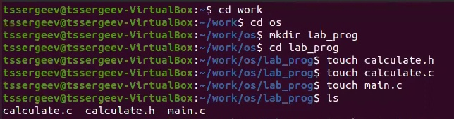
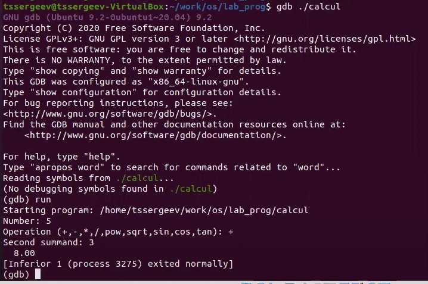

# Отчёт по лабораторной работе №14
## Средства, применяемые приразработке программного обеспечения в ОС типа UNIX/Linux

---

## Цель выполнения лабораторной работы

Приобрести простейшие навыки разработки, анализа, тестирования и отладки
приложений в ОС типа UNIX/Linux на примере создания на языке программирования С калькулятора с простейшими функциями.

---

## Задачи выполнения лабораторной работы

1. Ознакомиться с теоретическим материалом.

2. Выполнить упражнения.

3. Ответить на контрольные вопросы.

---

1. В домашнем каталоге создайте подкаталог ~/work/os/lab_prog.
   
2. Создайте в нём файлы: calculate.h, calculate.c, main.c.

---

Реализация функций калькулятора в файле calculate.с:
>     ////////////////////////////////////
>     // calculate.c
>     #include <stdio.h>
>     #include <math.h>
>     #include <string.h>
>     #include "calculate.h"
>     float
>     Calculate(float Numeral, char Operation[4])
>     {
>     float SecondNumeral;
>     if(strncmp(Operation, "+", 1) == 0)
>     {
>     printf("Второе слагаемое: ");
>     scanf("%f",&SecondNumeral);
>     return(Numeral + SecondNumeral);
>     }

---

Интерфейсный файл calculate.h, описывающий формат вызова функции-
калькулятора:
>     ///////////////////////////////////////
>     // calculate.h
>     #ifndef CALCULATE_H_
>     #define CALCULATE_H_
>     float Calculate(float Numeral, char Operation[4]);
>     #endif /*CALCULATE_H_*/

---

Основной файл main.c, реализующий интерфейс пользователя к калькулятору:
>     ////////////////////////////////////////
>     // main.c
>     #include <stdio.h>
>     #include "calculate.h"
>     int
>     main (void)
>     {
>     float Numeral;
>     char Operation[4];
>     float Result;
>     printf("Число: ");
>     scanf("%f",&Numeral);
>     printf("Операция (+,-,*,/,pow,sqrt,sin,cos,tan): ");
>     scanf("%s",&Operation);
>     Result = Calculate(Numeral, Operation);
>     printf("%6.2f\n",Result);
>     return 0;
>     }

---

Создайте Makefile со следующим содержанием:
>     ##
>     Makefile
>     #
>     CC = gcc
>     CFLAGS =
>     LIBS = -lm
>     calcul: calculate.o main.o
>     gcc calculate.o main.o -o calcul $(LIBS)
>     calculate.o: calculate.c calculate.h
>     gcc -c calculate.c $(CFLAGS)
>     main.o: main.c calculate.h
>     gcc -c main.c $(CFLAGS)
>     clean:
>     -rm calcul *.o *~
>     # End Makefile

---

---

## Вывод

В ходе выполнения поставленных задач я приобрел простейшие навыки разработки, анализа, тестирования и отладки приложений в ОС типа UNIX/Linux на примере создания на языке программирования С калькулятора с простейшими функциями.

---

# ***Спасибо за внимание!***
## ʕ ᵔᴥᵔ ʔ

